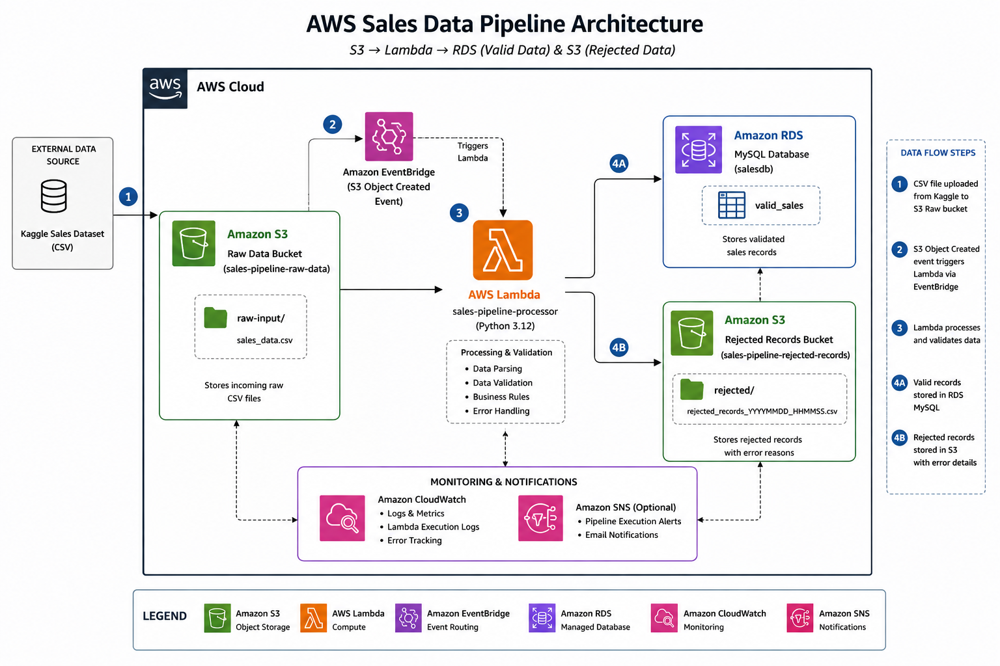

# AWS Sales Data Pipeline

## Project Overview

The **AWS Sales Data Pipeline** is a cloud-based data engineering project designed to demonstrate how transactional sales data can be ingested, validated, processed, stored, monitored, and transformed into business insights using Amazon Web Services (AWS).

The project uses the **Online Retail Dataset** and implements a cloud-based data-processing workflow using Amazon S3, AWS Lambda, Amazon EventBridge, Amazon RDS, Amazon SNS, Amazon CloudWatch, and AWS IAM.

## Business Problem

Businesses generate large volumes of transactional sales data that must be validated and organized before it can be used for reporting and decision-making.

Manual processing can make it difficult to identify invalid records, maintain organized datasets, store accepted records consistently, and generate useful business insights.

This project addresses the problem by automating the processing and validation of sales records in a cloud environment.

## Proposed Solution

The solution uses AWS managed services to create an automated sales data pipeline.

The pipeline:

1. Stores the raw sales CSV in Amazon S3.
2. Uses Amazon EventBridge to automate pipeline execution.
3. Invokes AWS Lambda for data processing and validation.
4. Separates valid and rejected records.
5. Stores valid and rejected outputs separately in Amazon S3.
6. Loads accepted records into Amazon RDS MySQL.
7. Sends pipeline notifications through Amazon SNS.
8. Uses Amazon CloudWatch for Lambda monitoring and logging.
9. Uses the processed data to produce a Sales KPI Dashboard.

## Architecture

The detailed AWS architecture diagram is available in `architecture/architecture.png`.

The architecture shows the relationship between the data source, Amazon S3, Amazon EventBridge, AWS Lambda, valid and rejected data outputs, Amazon RDS, Amazon SNS, Amazon CloudWatch, and the Sales KPI Dashboard.

## AWS Services Used

| AWS Service | Role in the Project |
|---|---|
| **Amazon S3** | Stores raw, valid, and rejected sales data |
| **Amazon EventBridge** | Automates scheduled execution of the pipeline |
| **AWS Lambda** | Performs serverless data processing and validation |
| **Amazon RDS MySQL** | Stores accepted sales records in structured relational storage |
| **Amazon SNS** | Sends pipeline completion and alert notifications |
| **Amazon CloudWatch** | Provides Lambda execution logs and monitoring |
| **AWS IAM** | Manages access and permissions between AWS resources |

## Dataset

The project uses the **Online Retail Dataset**, containing transactional sales records from a UK-based online retailer.

### Main Fields

- Invoice Number
- Stock Code
- Product Description
- Quantity
- Invoice Date
- Unit Price
- Customer ID
- Country

### Revenue Calculation

Revenue is calculated as:

`Revenue = Quantity × UnitPrice`

## How the Pipeline Works

### Step 1 — Data Ingestion

The Online Retail CSV dataset is uploaded to the raw data location in Amazon S3.

The raw dataset is preserved separately to maintain the original source data and provide traceability throughout the pipeline.

### Step 2 — Automated Execution

Amazon EventBridge is used to automate execution of the AWS Lambda processing function.

The configured rule is `sales-pipeline-monthly-trigger`.

The schedule expression is `cron(0 0 1 * ? *)`, which executes at midnight UTC on the first day of every month.

The scheduled rule targets the AWS Lambda processing function, reducing the need for manual execution.

### Step 3 — Data Processing

AWS Lambda, implemented using **Python 3.12**, performs the main data processing and validation activities.

The function reads the sales records, parses the data, applies predefined validation rules, and separates records into valid and rejected outputs.

### Step 4 — Data Validation

The pipeline applies basic data-quality and business validation rules.

Records may be rejected when they contain:

- Missing required values
- Zero or negative quantities
- Zero or negative unit prices

Records that satisfy the validation requirements are classified as valid.

### Step 5 — Data Separation

The processed records are organized into separate Amazon S3 locations:

- `data/raw/` — original source data
- `data/valid/` — records that passed validation
- `data/rejected/` — records that failed validation

Rejected records are not deleted. They are retained separately so that data-quality issues can be reviewed and investigated.

### Step 6 — Database Storage

Accepted records are loaded into an **Amazon RDS MySQL** database.

Amazon RDS provides structured relational storage for querying, reporting, and downstream analysis.

### Step 7 — Notifications

Amazon SNS provides operational notifications related to pipeline processing.

The notification component supports:

- Pipeline completion notifications
- Processing outcome notifications
- Alerts associated with rejected records or issues requiring attention

### Step 8 — Monitoring and Logging

Amazon CloudWatch is used to monitor the AWS Lambda processing environment.

Lambda execution logs and error information can be reviewed through CloudWatch to support troubleshooting and operational monitoring.

### Step 9 — Business Visualization

The accepted sales data is used to create a **Sales KPI Dashboard**.

The dashboard presents business-focused information including:

- Revenue KPIs
- Order trends
- Top products by revenue
- Top products by quantity
- Revenue by country
- Top customers
- Sales trends over time

The dashboard is stored in `visualizations/dashboard.html` and deployed through GitHub Pages.

## Data Validation Rules

The pipeline applies basic validation rules to determine whether individual sales records should be accepted or rejected.

### Accepted Records

A record is accepted when required fields are present and:

`Quantity > 0`

and

`UnitPrice > 0`

### Rejected Records

A record is rejected when required information is missing or when:

`Quantity <= 0`

or

`UnitPrice <= 0`

Rejected records are retained separately for traceability and review.

## Pipeline Results

The pipeline was tested using **50,000 sales records**.

| Result | Records | Percentage |
|---|---:|---:|
| Valid / Accepted | **30,315** | **60.6%** |
| Rejected | **19,685** | **39.4%** |
| **Total** | **50,000** | **100%** |

A total of **30,315 records** passed the defined validation rules, while **19,685 records** were rejected.

The rejected records were retained separately in Amazon S3 instead of being deleted, allowing the data-quality issues to be reviewed.

## Sales KPI Dashboard

A **Sales KPI Dashboard** was created using the accepted pipeline data.

The dashboard presents:

- Revenue KPIs
- Order trends
- Top products by revenue
- Top products by quantity
- Revenue by country
- Top customers
- Sales trends over time

Dashboard file:

`visualizations/dashboard.html`

### Live Dashboard

[View the Sales KPI Dashboard](https://faith-ogundusi.github.io/aws-sales-data-pipeline/)

## Repository Structure

The project repository is organized as follows:

`aws-sales-data-pipeline/`

- `architecture/`
  - `architecture.png`
- `data/`
  - `raw/`
  - `valid/`
  - `rejected/`
- `visualizations/`
  - `dashboard.html`
- `LICENSE`
- `README.md`

## Key Benefits

- Automates sales data processing and validation
- Improves data quality
- Separates valid and rejected records
- Provides organized cloud data storage
- Uses serverless processing with AWS Lambda
- Provides structured storage through Amazon RDS
- Provides operational notifications through Amazon SNS
- Supports monitoring through Amazon CloudWatch
- Converts processed data into useful business visualizations
- Provides a scalable foundation for future improvements

## Challenges Encountered

Key challenges during development included:

- Understanding how multiple AWS services work together as a complete pipeline
- Configuring IAM permissions between AWS resources
- Handling data-quality issues within the retail dataset
- Connecting AWS Lambda processing with Amazon RDS
- Transforming transactional data into meaningful business metrics
- Organizing and documenting the project professionally on GitHub

## Key Learning Outcomes

This project provided hands-on experience with:

- AWS cloud architecture
- Amazon S3
- AWS Lambda
- Amazon EventBridge
- Amazon RDS
- Amazon SNS
- Amazon CloudWatch
- AWS IAM
- Data validation and processing
- Data pipeline design
- Data visualization
- GitHub project documentation

## Future Enhancements

Possible improvements include:

- More advanced data-quality validation
- Schema and data-type validation
- Duplicate-record detection
- CloudWatch alarms
- More detailed SNS alert conditions
- Interactive dashboard filters
- Direct dashboard-to-database integration
- Amazon QuickSight for business intelligence
- AWS Glue and Amazon Athena for larger analytical workloads
- Additional event-driven automation

## Project Documentation

The full project report provides detailed information about the business problem, proposed solution, architecture, implementation, validation results, pipeline execution, challenges, lessons learned, and future enhancements.

## Author

**Faith Ogundusi**

*Data Engineer | AWS Cloud | Building Data Pipelines & Scalable Data Solutions*

[LinkedIn](https://www.linkedin.com/in/faith-ogundusi) · [GitHub](https://github.com/faith-ogundusi)

## Project Links

**GitHub Repository:**  
[aws-sales-data-pipeline](https://github.com/faith-ogundusi/aws-sales-data-pipeline)

**Live Dashboard:**  
[Sales KPI Dashboard](https://faith-ogundusi.github.io/aws-sales-data-pipeline/)
